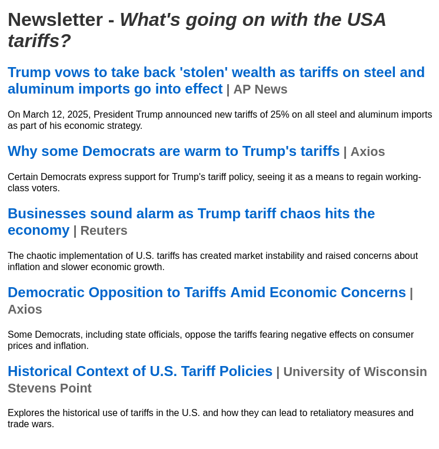

# AI News Aggregator Actor

## Overview
The **AI News Aggregator** is an Apify Actor that scrapes and aggregates top news stories based on a given search query. It uses AI to extract the core topic from the query, fetch relevant articles, and compile a well-structured newsletter summarizing the most important stories.

## Features
- **Automated Topic Extraction:** Uses AI to determine the most relevant topic from the user-provided query.
- **Web Scraping:** Gathers articles from reputable news sources.
- **Content Summarization:** Extracts key points from each article to create a concise, easy-to-read newsletter.
- **Formatted Output:** Returns results in a structured JSON format or as a ready-to-send email template.

## How It Works
1. **User Input:** Provide a search query (e.g., "latest in AI research").
2. **Topic Identification:** The AI extracts the primary topic from the query.
3. **News Collection:** The actor scrapes and retrieves top news stories related to the extracted topic.
4. **Summarization & Structuring:** Summaries are generated, and a newsletter is created.
5. **Output:** The final newsletter is returned in JSON or HTML format.

## Input Parameters
The actor expects the following input JSON:
```json
{
    "OPENAI_API_KEY": "", //optional
    "newsRequest": "What's going on with the USA tariffs?"
}
```

### Parameters:
- **newsRequest** (string, required): The search term or phrase for which to fetch news.
- **OPENAI_API_KEY** (string, optional): The OpenAI API key to use for summarization. You will be charged for usage if you don't provide your own key.

## Output Format

### Be sure to check the "Storage > Key-value store output tab for the HTML/MD report files.

**HTML Newsletter**
The HTML content can be directly copied into an email message body to have a perfectly structed newsletter ready to send.

### JSON Output:
```json
{
  "topic": "What's going on with the USA tariffs?",
  "articles": [
    {
        "title": "Trump vows to take back 'stolen' wealth as tariffs on steel and aluminum imports go into effect",
        "source": "AP News",
        "link": "https://apnews.com/article/e5a6295577275045db3484b71c979bfb?utm_source=openai",
        "summary": "On March 12, 2025, President Trump announced new tariffs of 25% on all steel and aluminum imports as part of his economic strategy."
    },
    ...
  ]
}
```

### HTML Output:
The HTML output is a fully formatted newsletter ready for email distribution.
   ```

### Running on Apify
1. Deploy the actor to Apify.
2. Provide input via Apify’s web UI or API.
3. Retrieve results via Apify’s dataset API.

## Use Cases
- **Daily News Digests**: Automate newsletter creation for specific industries or interests.
- **Market Research**: Track trends in technology, finance, or politics.
- **Content Aggregation**: Generate curated content for blogs or social media.
